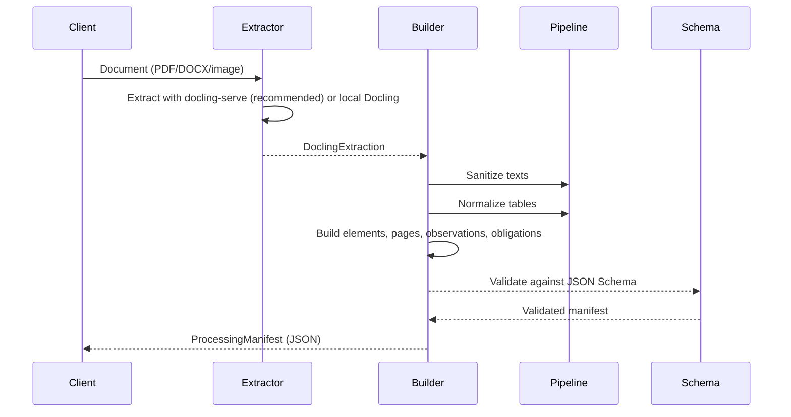

# Architecture

## Overview

The **Acessilia Structure Extractor** is a microservice that exposes document structure extraction as an independent service within the [Acessilia](https://github.com/A11yDevs/acessilia) ecosystem.

```mermaid
graph TB
    subgraph "Clients"
        CLI[CLI<br/>acessilia-extract]
        API[REST API]
        MCP[MCP Tools]
    end

    subgraph "Structure Extractor"
        EXTRACTORS[Extractors]
        MANIFEST[Manifest Builder]
        PIPELINE[Pipeline]
        SCHEMA[JSON Schema]
    end

    subgraph "Backends"
        DOCLING_SERVE[docling-serve ★]
        DOCLING[Docling (local)]
        PYMUPDF[PyMuPDF]
    end

    CLI --> EXTRACTORS
    API --> EXTRACTORS
    MCP --> EXTRACTORS
    EXTRACTORS --> DOCLING_SERVE
    EXTRACTORS -.-> DOCLING
    EXTRACTORS -.-> PYMUPDF
    EXTRACTORS --> MANIFEST
    MANIFEST --> PIPELINE
    MANIFEST --> SCHEMA
```

## Directory Structure

```
├── pyproject.toml                  # Package configuration and dependencies
├── Dockerfile                      # Multi-stage build (base, docling, production)
├── docker-compose.yml              # Orchestration for dev and production
├── docker-compose.test-snapshot.yml# Snapshot validation with docling-serve
├── schemas/
│   └── processing_manifest.schema.json  # JSON Schema Draft 2020-12
├── scripts/
│   └── validate_snapshots.py       # Snapshot validation script
├── src/
│   └── acessilia_extractor/
│       ├── __init__.py             # Package version
│       ├── extractors.py           # Extraction backends (Docling, docling-serve)
│       ├── cli/
│       │   └── __init__.py         # Command-line interface
│       ├── manifest/
│       │   ├── __init__.py         # Exports ProcessingManifest
│       │   ├── builder.py          # Builds the manifest from extraction
│       │   ├── models.py           # Pydantic models for Processing Manifest
│       │   └── schema.py           # JSON Schema generation and validation
│       └── pipeline/
│           ├── __init__.py
│           ├── sanitizer.py        # Text sanitization (prompt leaks, markdown)
│           └── table_ast.py        # Table normalization (AST)
├── tests/
│   ├── conftest.py                 # Shared test configuration
│   ├── snapshot_comparator.py      # Snapshot comparator (removes volatile fields)
│   ├── test_processing_manifest.py # Unit tests for the manifest
│   ├── test_snapshot.py            # Snapshot tests with docling-serve
│   └── dataset/                    # Submodule: A11yDevs/acessilia-dataset
└── docs/
    └── ...                         # This documentation
```

## Modules

### `extractors.py` — Extraction Backends

Defines the abstract `BaseExtractor` interface and two implementations:

- **`DoclingServeExtractor`** (recommended): Remote extraction via the `docling-serve` REST API. Sends the file via multipart upload and receives the serialized `DoclingDocument` as JSON. Includes the `_BuildDoclingDocument` wrapper for compatibility with the builder's expected interface. This is the **default** backend.
- **`DoclingManifestExtractor`**: Local extraction using Docling installed in the same environment. Requires the `[docling]` extra. Configures the PDF pipeline with OCR (RapidOCR) and table structure detection.

Both return a `DoclingExtraction` (dataclass) with the extracted document, timestamps, duration, and configuration.

### `manifest/` — Processing Manifest

The heart of the project. Responsible for transforming the raw extractor output into a canonical **Processing Manifest**.

- **`models.py`**: Pydantic v2 models with strict validation:
  - `ProcessingManifest` — manifest root
  - `SourceDocument` — source document metadata
  - `ExtractorRun` — extractor execution metadata
  - `ManifestElement` — each structural element (title, heading, paragraph, table, etc.)
  - `PageDescriptor` — page description with element references
  - `Observation` — observations about elements
  - `Obligation` — accessibility obligations (e.g., describe image, linearize table)
  - `Artifact` — artifacts generated during processing
  - `ManifestSummary` — summary with counts

- **`builder.py`**: Builds the `ProcessingManifest` from a `DoclingExtraction`:
  - Maps Docling labels to canonical types (`LABEL_TO_TYPE`)
  - Derives accessibility obligations by element type (`OBLIGATION_BY_TYPE`)
  - Identifies **callouts** (notes, warnings, tips) by grouping visual elements
  - Infers document title
  - Sanitizes text via `pipeline/sanitizer.py`
  - Normalizes tables via `pipeline/table_ast.py`

- **`schema.py`**: Generates JSON Schema Draft 2020-12 from Pydantic models and performs dual validation (Pydantic + jsonschema).

### `pipeline/` — Processing Utilities

- **`sanitizer.py`**: Removes control characters, prompt leaks, Markdown artifacts, and audio description metadata.
- **`table_ast.py`**: Normalizes, parses, and linearizes table structures into a canonical AST.

### `cli/` — Command-Line Interface

```bash
acessilia-extract document.pdf -o output.json
acessilia-extract document.pdf --docling-serve http://localhost:5001
```

### `tests/` — Test Suite

- **`test_processing_manifest.py`**: Unit tests with `FakeDocument` — validates construction, candidate obligations, and schemas.
- **`test_snapshot.py`**: Snapshot tests against the dataset — extracts documents via docling-serve and compares with expected outputs.
- **`snapshot_comparator.py`**: Removes volatile fields (timestamps, hashes, IDs) to compare only the semantic structure.

## Extraction Flow



## Architectural Decisions

### Separation from Main Runtime

The Structure Extractor is a **separate** service from the main Acessilia for:

1. **Dependency isolation**: Docling, PyTorch, RapidOCR are heavy dependencies that significantly increase Docker image size.
2. **Independent scalability**: The extractor can be scaled horizontally based on document processing demand.
3. **Independent evolution**: The Processing Manifest contract allows swapping the extraction engine without impacting consumers.

### Canonical Contract

The **Processing Manifest** (`urn:a11y-devs:schema:processing-manifest:1.1.0`) is the central contract. Consumers (Acessilia orchestrator, specialized agents, MCP clients) depend only on this schema, never on Docling's internal structures.

### Multiple Backend Support

The `BaseExtractor` interface allows adding new backends without modifying the builder. Currently:

| Backend | Type | Use Case |
|---|---|---|
| docling-serve | Remote (REST) ★ | **Recommended** — Docling in Docker, no local ML |
| Docling | Local | Legacy — full pipeline with OCR and tables |
| PyMuPDF | Planned | Lightweight extraction without ML |

### Multi-stage Docker

The `Dockerfile` offers multiple targets for different scenarios:

| Target | Docling | Use Case |
|---|---|---|
| `production` | ❌ | **Default** — uses remote docling-serve |
| `with-docling` | ✅ | Legacy — local Docling (not recommended) |
| `validate-snapshots` | ✅ | Snapshot validation |
| `production-docling` | ✅ | Production with embedded Docling |
| `test` | ❌ | Unit tests |