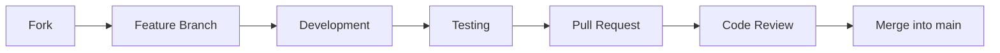

# Contribution

## How to Contribute

Thank you for your interest in contributing to the **Acessilia Structure Extractor**! This document describes the contribution workflow, coding standards, and best practices.

## Workflow



### 1. Fork and Clone

```bash
git clone https://github.com/your-username/acessilia-structure-extractor.git
cd acessilia-structure-extractor
git remote add upstream https://github.com/A11yDevs/acessilia-structure-extractor.git
```

### 2. Create a Branch

```bash
git checkout -b feat/my-feature
```

Use semantic prefixes:

| Prefix | Description |
|---|---|
| `feat/` | New feature |
| `fix/` | Bug fix |
| `docs/` | Documentation |
| `refactor/` | Refactoring |
| `test/` | Tests |
| `chore/` | Maintenance |

### 3. Develop

- Keep code compatible with Python >= 3.11
- Follow existing code standards (type hints, docstrings, etc.)
- Add tests for new functionality
- Update documentation when necessary

### 4. Testing

```bash
# Install development dependencies
pip install ".[dev]"

# Configure environment (optional — .env is gitignored)
cp .env.example .env

# Start docling-serve (required for snapshot tests)
docker run -d \
  --name docling-serve \
  -p 5001:5001 \
  -v docling-models:/root/.cache/docling \
    ghcr.io/docling-project/docling-serve-cpu:v1.32.0

# Run tests (reads DOCLING_SERVE_URL from .env or defaults)
pytest tests/ -v

# Or use Docker Compose for the full test suite
docker compose -f docker-compose.test-snapshot.yml up --build validator
```

### 5. Submit a Pull Request

1. Update your branch with the latest `main`:

```bash
git fetch upstream
git rebase upstream/main
```

2. Open a PR on [GitHub](https://github.com/A11yDevs/acessilia-structure-extractor/pulls)
3. Fill in the template with:
   - Clear description of the change
   - Related issue (if any)
   - Verification checklist
   - Test evidence (screenshots, logs)

## Coding Standards

### Style

- **Python**: Follow [PEP 8](https://peps.python.org/pep-0008/) and [PEP 484](https://peps.python.org/pep-0484/) (type hints)
- **Docstrings**: Google-style or reStructuredText
- **Imports**: Order: stdlib → third-party → local (separated by blank lines)

### Example

```python
"""Example module — follow this pattern."""

from __future__ import annotations

from datetime import datetime
from pathlib import Path
from typing import Any

from pydantic import BaseModel


class MyModel(BaseModel):
    """Example model with Google-style docstring.

    Attributes:
        name: Field description.
        value: Field description.
    """

    name: str
    value: int
```

### Commits

Use [Conventional Commits](https://www.conventionalcommits.org/):

```
feat: add PyMuPDF extractor
fix: fix schema validation for empty elements
docs: update API documentation
test: add tests for manifest builder
refactor: extract table normalization logic
```

## Tests

### Test Types

| Type | File | Description |
|---|---|---|
| Unit | `test_processing_manifest.py` | Tests with `FakeDocument`, no external dependencies |
| Snapshot | `test_snapshot.py` | Tests against real dataset, requires docling-serve |

### Writing Tests

```python
"""Tests for my module."""

from pathlib import Path

import pytest


def test_basic_functionality():
    """Tests expected behavior."""
    result = my_function("input")
    assert result == "expected"


@pytest.mark.asyncio
async def test_async_functionality():
    """Tests async behavior."""
    result = await my_async_function()
    assert result is not None
```

### Snapshots

Snapshots compare the extractor output with expected outputs in the dataset. To update:

```bash
python scripts/validate_snapshots.py --update
```

## Documentation

- Every public function must have a docstring
- API or schema changes must update the documentation in `docs/`
- The JSON Schema at `schemas/processing_manifest.schema.json` must be kept in sync with the Pydantic models

## CI/CD

GitHub Actions automatically runs:

1. **Tests** on Python 3.11 (slim and with Docling)
2. **Snapshot validation** against the dataset
3. **Docker build and push** to GHCR

To verify locally before a PR:

```bash
# Unit tests
docker compose run --rm test

# Snapshot validation
docker compose -f docker-compose.test-snapshot.yml up --build
```

## Issues

- Use [issues](https://github.com/A11yDevs/acessilia-structure-extractor/issues) to report bugs or suggest features
- Follow the available template when creating a new issue
- Tag with appropriate labels (`bug`, `enhancement`, `documentation`, etc.)

## Code of Conduct

This project adopts the [Acessilia Code of Conduct](https://github.com/A11yDevs/acessilia/blob/main/CODE_OF_CONDUCT.md). Participate with respect and collaboration.

## Questions?

Open a [discussion](https://github.com/A11yDevs/acessilia-structure-extractor/discussions) or contact the maintainers.