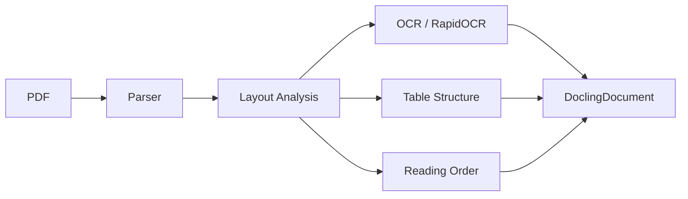

# Extraction Tools

## Overview

The Acessilia Structure Extractor supports multiple document extraction backends, each with its own characteristics. The abstract `BaseExtractor` interface allows switching between them without modifying the manifest building pipeline.

## Docling

[Docling](https://github.com/docling-project/docling) is the primary extraction engine. Developed by IBM, it provides deep structural understanding of documents.

### Features

| Feature | Support |
|---|---|
| **Input formats** | PDF, DOCX, XLSX, PPTX, HTML, images |
| **OCR** | ✅ (RapidOCR, Tesseract) |
| **Table structure** | ✅ (specialized model) |
| **Heading hierarchy** | ✅ |
| **Reading order** | ✅ |
| **Figures and images** | ✅ |
| **Formulas** | ✅ |
| **Lists** | ✅ |
| **Footnotes** | ✅ |
| **Headers/footers** | ✅ |
| **ML models** | ✅ (downloaded at runtime) |
| **Languages** | Multilingual (OCR + layout) |

### Docling Architecture



### Usage in the Project

Docling is used in two ways:

1. **Local** (`DoclingManifestExtractor`): Installed in the same environment, loads models at runtime.
2. **Remote** (`DoclingServeExtractor`): Via `docling-serve`, REST communication.

### Dependencies

```toml
[project.optional-dependencies]
docling = [
    "docling>=2",
]
```

### Model Cache

Models are downloaded automatically on first run:

- **Hugging Face**: `~/.cache/huggingface` (or `/root/.cache/docling` in Docker)
- **RapidOCR**: cache managed by Docling

> ⚠️ The first run is significantly slower due to model downloads.

## docling-serve

[docling-serve](https://github.com/docling-project/docling-serve) is the REST server that exposes Docling as a service.

### Features

| Feature | Support |
|---|---|
| **REST API** | ✅ (v1) |
| **Multipart upload** | ✅ |
| **JSON output** | ✅ (serialized DoclingDocument) |
| **Processing queue** | ✅ |
| **Health check** | ✅ (`/health`) |
| **Multiple formats** | ✅ (json, text, markdown) |
| **GPU** | ✅ (`docling-serve` image) |
| **CPU** | ✅ (`docling-serve-cpu` image) |

### Usage with Docker

```bash
# Start docling-serve
docker run -p 5001:5001 \
  -v docling-models:/root/.cache/docling \
  ghcr.io/docling-project/docling-serve-cpu:latest

# Extract via API
curl -X POST http://localhost:5001/v1/convert/file \
  -F "files=@document.pdf" \
  -F "to_formats=[\"json\"]"
```

### Integration

The `DoclingServeExtractor` sends the document via multipart upload and receives the JSON content. A wrapper (`_BuildDoclingDocument`) converts the response to the interface expected by the builder.

```python
from acessilia_extractor.extractors import DoclingServeExtractor

extractor = DoclingServeExtractor(base_url="http://docling-serve:5001")
extraction = extractor.extract(Path("document.pdf"))
```

## PyMuPDF (fitz)

[PyMuPDF](https://pymupdf.readthedocs.io/) is a lightweight alternative for basic extraction.

### Features

| Feature | Support |
|---|---|
| **Formats** | PDF, images |
| **OCR** | ❌ (not native) |
| **Text** | ✅ |
| **Tables** | ⚠️ (basic) |
| **Images** | ✅ |
| **Metadata** | ✅ |
| **Annotations** | ✅ |
| **Dependencies** | Minimal (no ML) |

### Project Status

PyMuPDF is listed as a base dependency and is planned as an alternative backend for lightweight extraction without ML models. There is currently no `PyMuPDFExtractor` implemented — the `BaseExtractor` interface is ready to receive it.

### Planned Use Cases

- Fast text extraction without heavy dependencies
- Fallback when Docling is unavailable
- Metadata and annotation extraction
- Pre-processing for structure validation

## Comparison

| Criteria | Docling | docling-serve | PyMuPDF |
|---|---|---|---|
| **Structural accuracy** | High | High | Medium |
| **Speed** | Slow (models) | Slow + network latency | Fast |
| **Image size** | ~3 GB | ~3 GB (server) | ~200 MB |
| **OCR** | ✅ | ✅ | ❌ |
| **Tables** | ✅ | ✅ | ⚠️ |
| **ML models** | ✅ | ✅ | ❌ |
| **Offline use** | ✅ (after cache) | ✅ (after cache) | ✅ |
| **Recommended for** | Maximum accuracy | Separate deployment | Fast extraction |

## Post-processing Pipeline

Regardless of the backend, the post-processing pipeline includes:

### Sanitization (`pipeline/sanitizer.py`)

- Removes control characters
- Removes prompt leaks (patterns like "chain of thought", "ignore previous instructions")
- Removes Markdown artifacts (headings, lists, bold/italic)
- Removes audio description metadata

### Table Normalization (`pipeline/table_ast.py`)

- Converts varied table representations into a canonical AST
- Supports header/body/footer sections
- Preserves captions and metadata
- Enables linearization for sequential reading