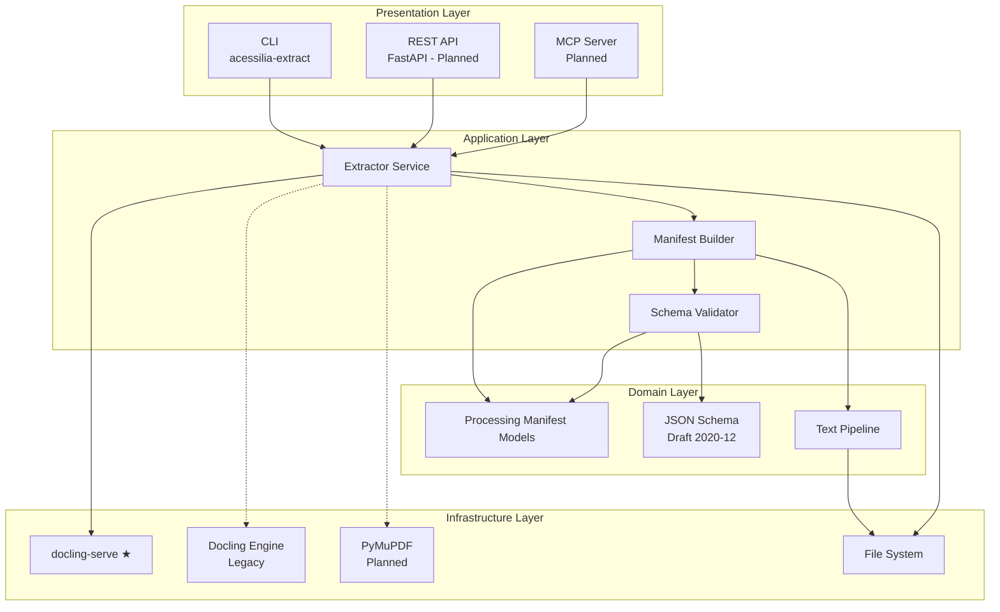
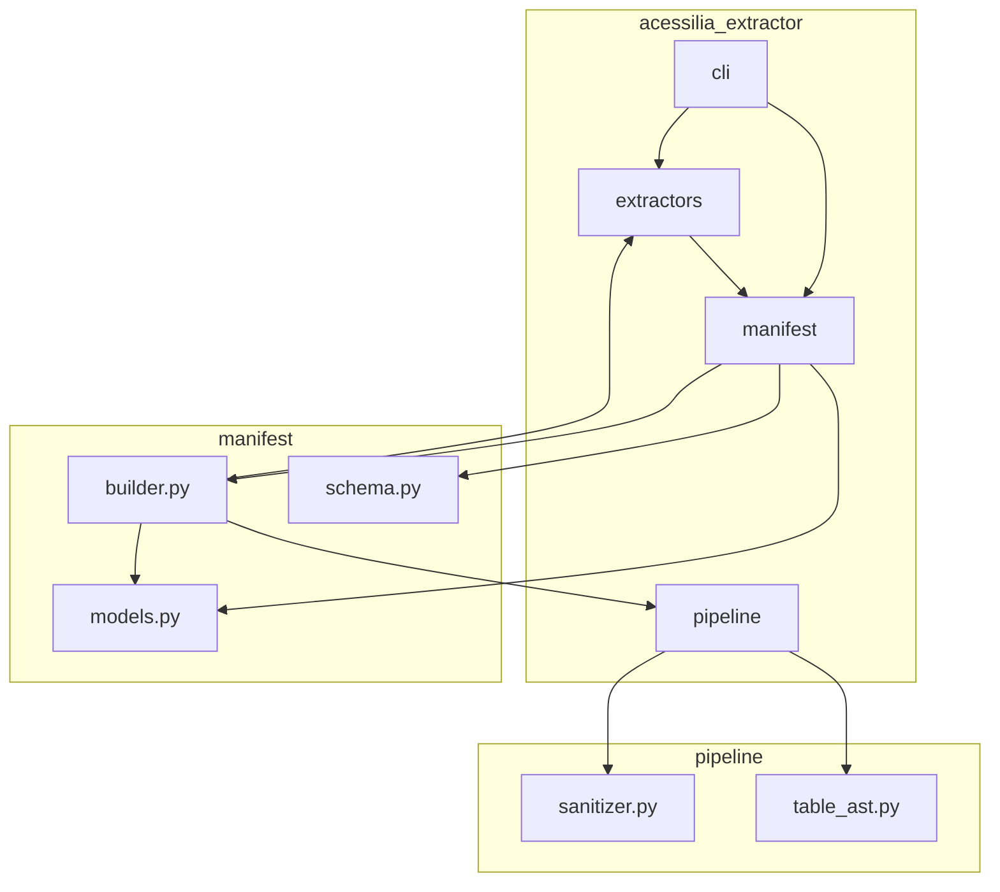
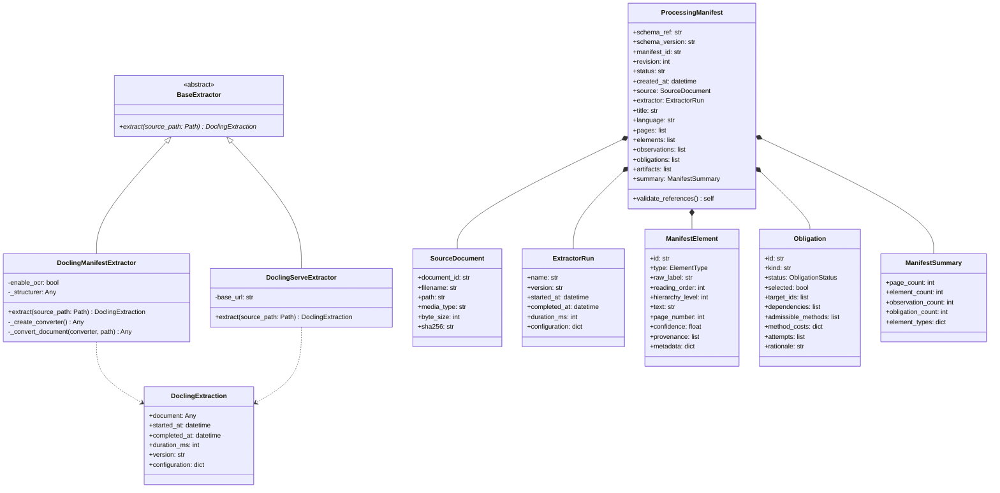
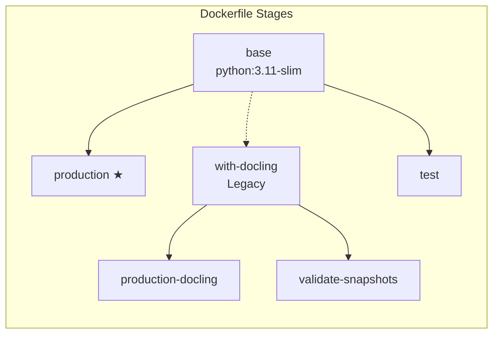
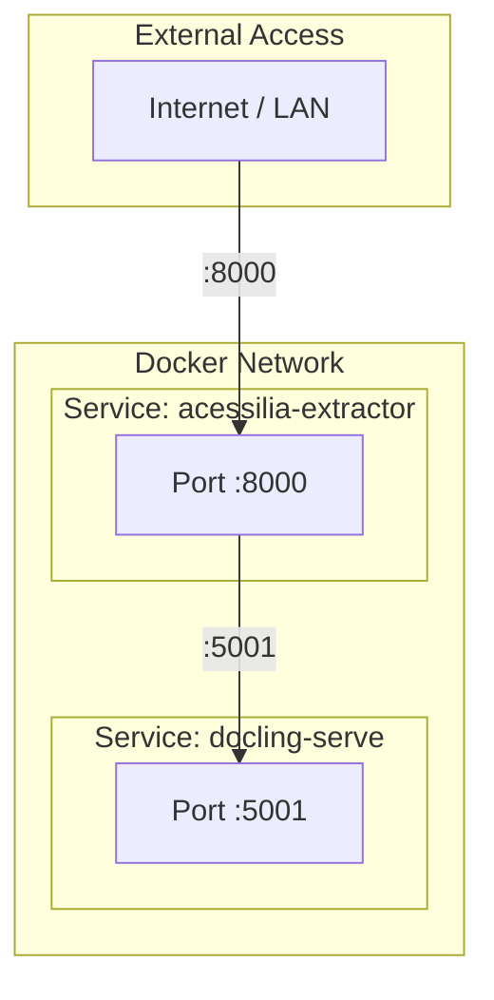
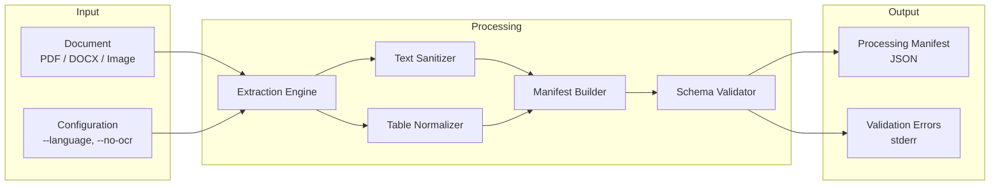

# Logical and Physical Architecture

## Logical Architecture

The logical architecture describes the system's components, their responsibilities, and the relationships between them, independent of deployment details.

### Component Diagram



### Layer Responsibilities

| Layer | Components | Responsibility |
|---|---|---|
| **Presentation** | CLI, REST API, MCP | Interface with users and external systems |
| **Application** | Extractor Service, Manifest Builder, Schema Validator | Orchestrate extraction and manifest generation |
| **Domain** | Processing Manifest Models, JSON Schema, Text Pipeline | Core business logic and canonical representation |
| **Infrastructure** | docling-serve, Docling, PyMuPDF, File System | External tools and I/O |

### Package Diagram



### Class Diagram (Core Domain)



## Physical Architecture

The physical architecture describes how the system is deployed, the infrastructure components, and communication paths.

### Deployment Diagram

```mermaid
graph TB
    subgraph "Developer Machine"
        CLI[acessilia-extract CLI]
        DEV_ENV[Python 3.11+]
    end

    subgraph "Docker Host - Production"
        subgraph "Container: acessilia-extractor"
            API_PROC[Structure Extractor Process]
            VOL_CONFIG[/app/config]
        end

        subgraph "Container: docling-serve"
            SERVE[docling-serve]
            VOL_MODELS[/root/.cache/docling]
        end

        VOL_DATA[Volume: ./var]
        VOL_DOCLING[Volume: docling-models]
    end

    subgraph "Docker Host - Dev/Validation"
        subgraph "Container: validator"
            VAL[validate_snapshots.py]
        end
        subgraph "Container: test"
            TEST[pytest]
        end
    end

    subgraph "External"
        GHCR[GitHub Container Registry]
        DATASET[acessilia-dataset<br/>Git Submodule]
    end

    CLI -->|HTTP :8000| API_PROC
    API_PROC -->|HTTP :5001| SERVE
    API_PROC --> VOL_DATA
    SERVE --> VOL_DOCLING

    VAL -->|HTTP :5001| SERVE
    VAL --> DATASET

    TEST --> API_PROC

    GHCR -->|docker pull| API_PROC
    GHCR -->|docker pull| SERVE
```

### Docker Build Architecture



### Network Architecture



### Container Specifications

| Container | Base Image | Size | Port | Dependencies |
|---|---|---|---|---|
| `acessilia-extractor` (production) | python:3.11-slim | ~200 MB | 8000 | httpx, PyMuPDF, pydantic |
| `acessilia-extractor` (with-docling) | python:3.11-slim | ~3 GB | 8000 | + docling, torch, rapidocr |
| `docling-serve` | ghcr.io/docling-project/serve-cpu | ~3 GB | 5001 | docling, torch, rapidocr |
| `validator` | python:3.11-slim | ~200 MB | — | + httpx (uses docling-serve) |
| `test` | python:3.11-slim | ~200 MB | — | + pytest |

### Data Flow Diagram



### Technology Stack

| Layer | Technology | Version |
|---|---|---|
| **Language** | Python | >= 3.11 |
| **Data Models** | Pydantic | >= 2 |
| **Schema Validation** | jsonschema (Draft 2020-12) | — |
| **HTTP Client** | httpx | >= 0.28 |
| **PDF/Light Extraction** | PyMuPDF | — |
| **Full Extraction** | docling-serve (recommended) | latest |
| **Local Extraction** | Docling | >= 2 |
| **OCR** | RapidOCR | — |
| **ML Runtime** | PyTorch (CPU) | — |
| **Testing** | pytest | >= 7 |
| **Container Runtime** | Docker | — |
| **Orchestration** | Docker Compose | — |
| **Registry** | GitHub Container Registry | — |