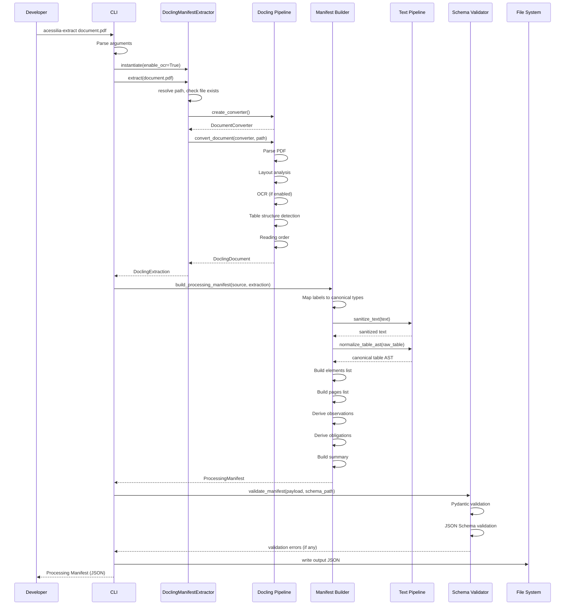
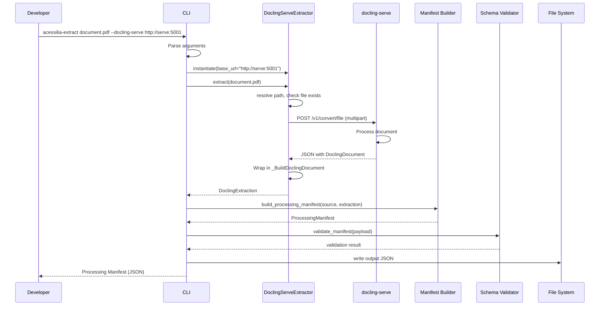
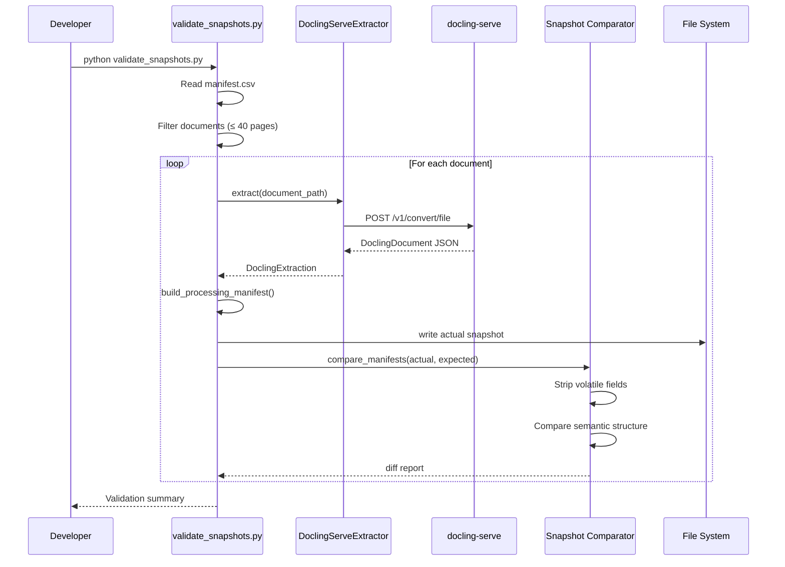
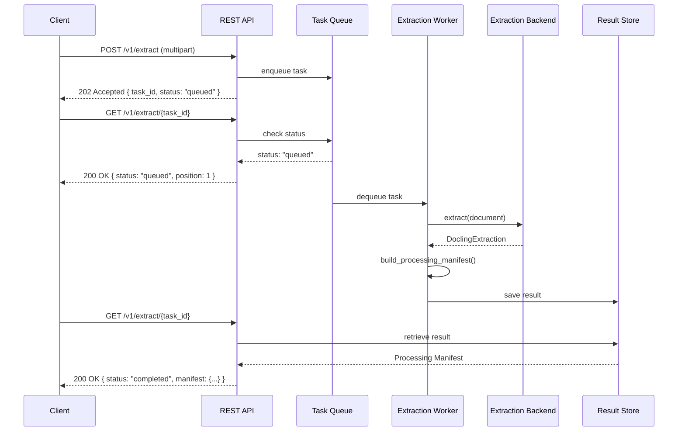
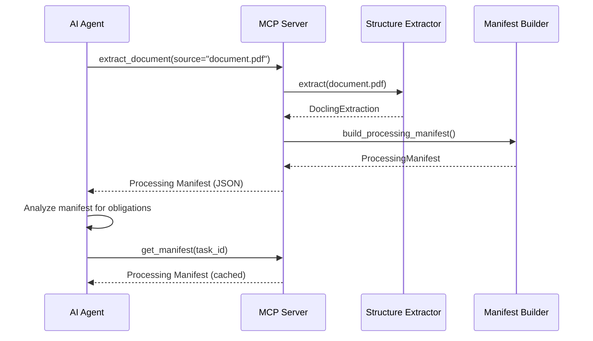
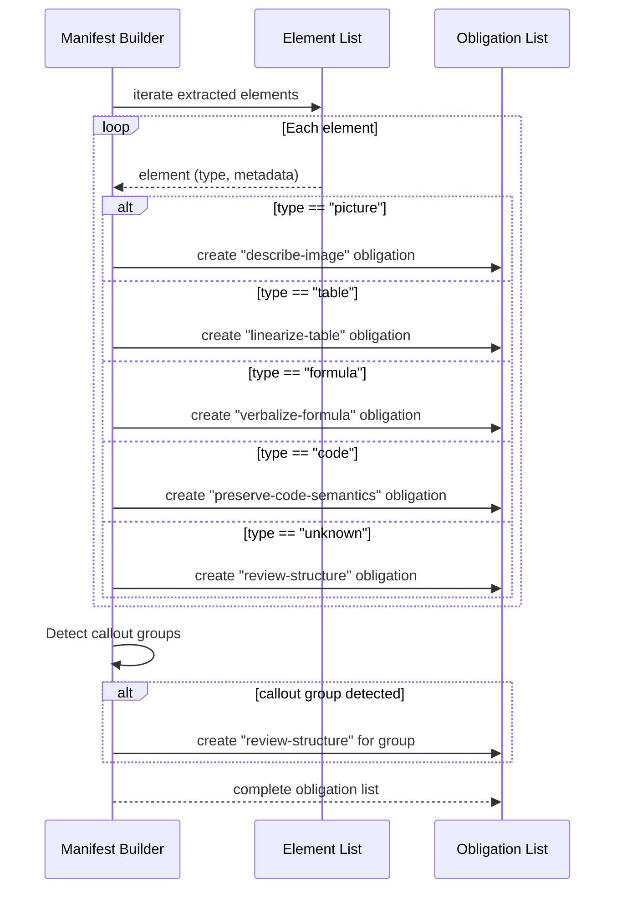
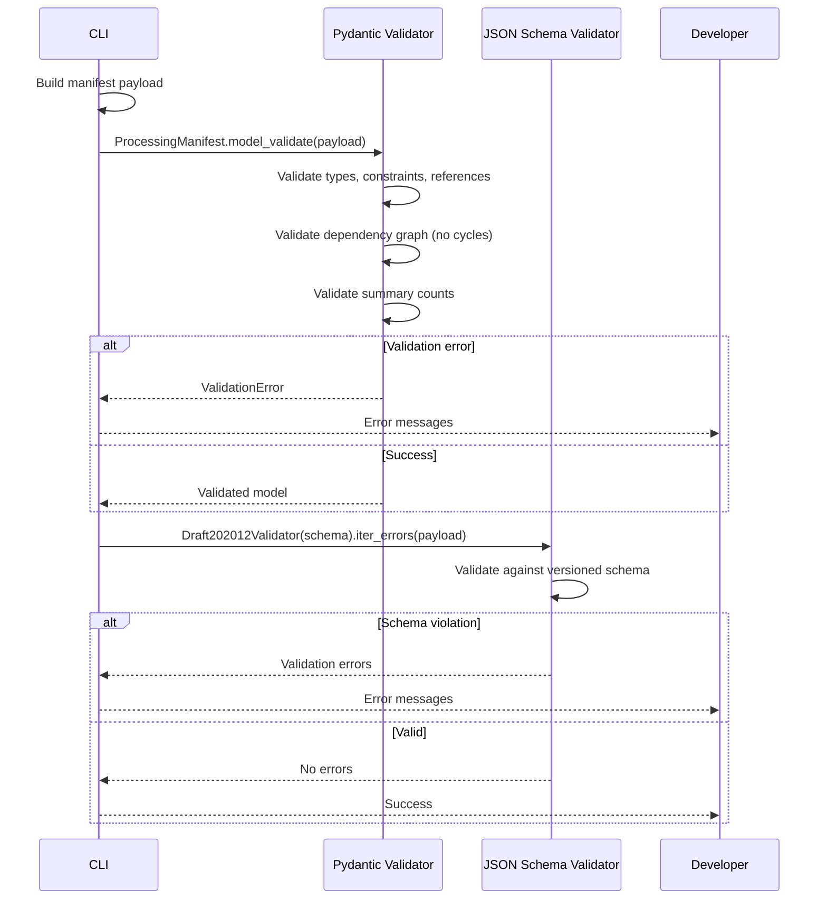

# Sequence Diagrams

## Overview

This document contains sequence diagrams for the key interaction flows of the **Acessilia Structure Extractor**. Each diagram illustrates the message exchange between components for a specific scenario.

## 1. Document Extraction (CLI — Local Docling) [Legacy]

> **Note**: This flow uses local Docling installation. The **recommended** flow is via docling-serve (see diagram 2 below).

## 2. Document Extraction (CLI — Remote docling-serve) ★

> **Default flow**: This is the recommended extraction path. It requires Docker for docling-serve but avoids local ML dependencies.

## 3. Snapshot Validation

## 4. REST API (Planned) — Async Extraction Flow

## 5. MCP (Planned) — AI Agent Consumption

## 6. Obligation Derivation Flow

## 7. Dual Validation Flow

