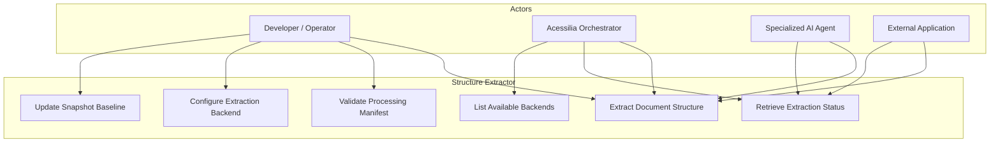
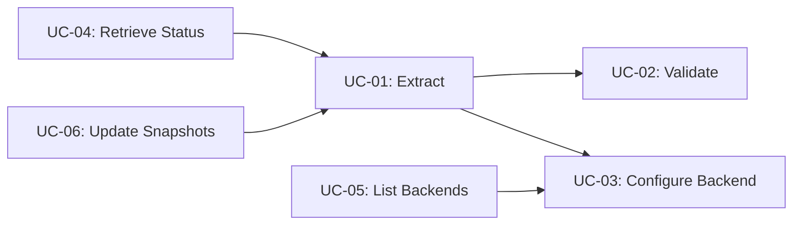

# Use Cases

## Overview

This document describes the use cases for the **Acessilia Structure Extractor**. Actors interact with the service through CLI, REST API (planned), or MCP (planned).

## Use Case Diagram

## Actor Descriptions

| Actor | Description |
|---|---|
| **Developer / Operator** | Human user who runs the CLI to extract documents, validate manifests, or manage the service |
| **Acessilia Orchestrator** | Central Acessilia system that consumes the Structure Extractor as part of the accessibility pipeline |
| **Specialized AI Agent** | Autonomous agent (e.g., image describer, table linearizer) that consumes manifests to identify processing needs |
| **External Application** | Any third-party application that consumes document structure via REST API or MCP |

## Use Case Specifications

### UC-01: Extract Document Structure

| Field | Value |
|---|---|
| **ID** | UC-01 |
| **Name** | Extract Document Structure |
| **Actors** | Developer, Orchestrator, AI Agent, External Application |
| **Trigger** | A document is submitted for structural analysis |
| **Preconditions** | Document exists and is in a supported format (PDF, DOCX, image) |
| **Postconditions** | A valid Processing Manifest is generated |

**Basic Flow:**

1. Actor submits a document via CLI, REST API, or MCP
2. System selects the appropriate extraction backend (Docling, docling-serve, or PyMuPDF)
3. System extracts structural elements (headings, paragraphs, tables, figures, etc.)
4. System sanitizes text and normalizes tables
5. System builds the Processing Manifest with elements, observations, and obligations
6. System validates the manifest against the JSON Schema
7. System returns the validated Processing Manifest

**Alternative Flows:**

- **1a. Backend unavailable**: System falls back to an alternative backend or returns an error
- **3a. OCR required**: If the document is scanned and OCR is enabled, system runs OCR before extraction
- **6a. Validation fails**: System reports validation errors and returns exit code 1

---

### UC-02: Validate Processing Manifest

| Field | Value |
|---|---|
| **ID** | UC-02 |
| **Name** | Validate Processing Manifest |
| **Actors** | Developer |
| **Trigger** | A manifest JSON needs validation against the schema |
| **Preconditions** | A manifest JSON file exists |
| **Postconditions** | Validation report is produced |

**Basic Flow:**

1. Actor runs the CLI with `--schema` pointing to a schema file
2. System validates the manifest against the JSON Schema (Draft 2020-12)
3. System validates the manifest against Pydantic models
4. System reports any validation errors

---

### UC-03: Configure Extraction Backend

| Field | Value |
|---|---|
| **ID** | UC-03 |
| **Name** | Configure Extraction Backend |
| **Actors** | Developer |
| **Trigger** | Developer needs to switch between extraction backends |
| **Preconditions** | The desired backend is available |
| **Postconditions** | Extraction uses the selected backend |

**Basic Flow:**

1. Actor specifies backend via CLI flags (`--docling-serve`, `--no-ocr`)
2. System instantiates the appropriate extractor
3. System proceeds with extraction using the configured backend

---

### UC-04: Retrieve Extraction Status

| Field | Value |
|---|---|
| **ID** | UC-04 |
| **Name** | Retrieve Extraction Status |
| **Actors** | Orchestrator, AI Agent, External Application |
| **Trigger** | A previous extraction request needs status checking |
| **Preconditions** | An extraction task was submitted |
| **Postconditions** | Status information is returned |

**Basic Flow:**

1. Actor requests status via REST API (`GET /v1/extract/{task_id}`)
2. System returns current status (queued, processing, completed, failed)
3. If completed, system includes the manifest in the response

---

### UC-05: List Available Backends

| Field | Value |
|---|---|
| **ID** | UC-05 |
| **Name** | List Available Backends |
| **Actors** | Orchestrator |
| **Trigger** | Orchestrator needs to discover available extraction capabilities |
| **Preconditions** | Service is running |
| **Postconditions** | Backend list is returned |

**Basic Flow:**

1. Actor queries the service health endpoint
2. System returns available backends and their status

---

### UC-06: Update Snapshot Baseline

| Field | Value |
|---|---|
| **ID** | UC-06 |
| **Name** | Update Snapshot Baseline |
| **Actors** | Developer |
| **Trigger** | Extraction logic has changed and snapshots need updating |
| **Preconditions** | Dataset documents exist |
| **Postconditions** | Expected outputs are updated |

**Basic Flow:**

1. Actor runs `scripts/validate_snapshots.py --update`
2. System extracts all documents in the dataset
3. System overwrites expected outputs with new extraction results
4. System confirms the update

## Use Case Relationships

## Requirements Traceability

| Use Case | Functional Requirement | Module |
|---|---|---|
| UC-01 | Document extraction and manifest generation | `extractors.py`, `manifest/builder.py` |
| UC-02 | Dual validation (Pydantic + JSON Schema) | `manifest/schema.py` |
| UC-03 | Backend selection and configuration | `extractors.py`, `cli/__init__.py` |
| UC-04 | Task status tracking | REST API (planned) |
| UC-05 | Backend discovery | REST API (planned) |
| UC-06 | Snapshot update workflow | `scripts/validate_snapshots.py` |